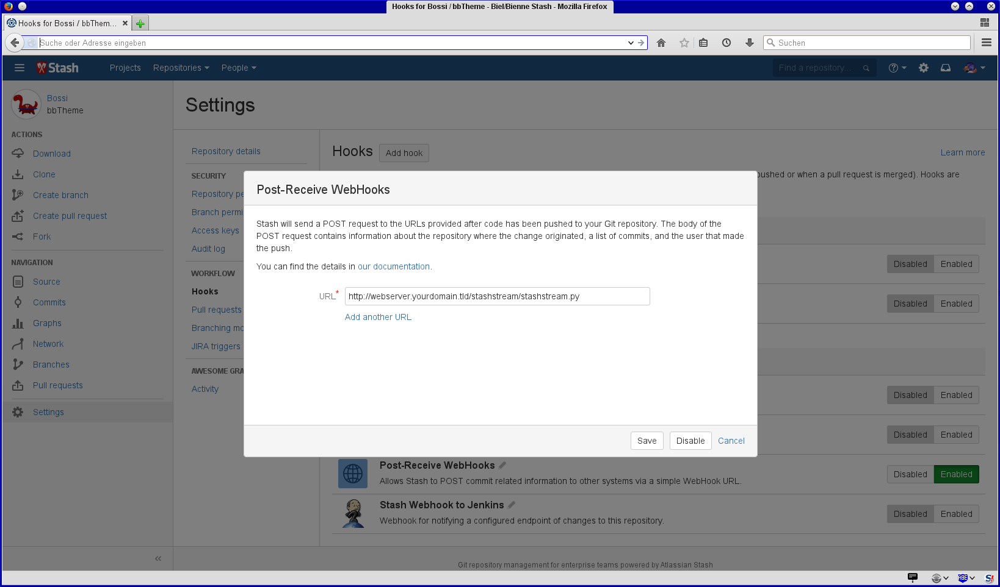
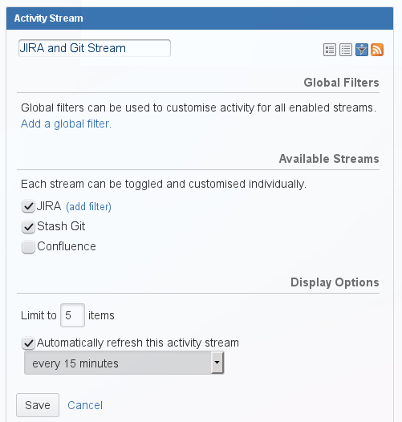
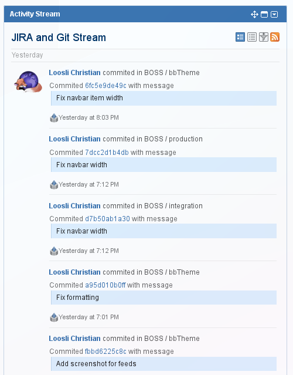

# Stash stream python script

This script provides an easy way to see stash git commits in your JIRA activity stream.
It relies on the web hooks plugin (or any other way to call an URL on every commit)

# Installation

The script needs python 2.7 with urllib2, requests, datetime, logging and dateutil. 
It has to be callable by a web server, e.g. Apache's httpd via cgi. 

On the stash side you need the [Web Post Receive Hooks Plugin](https://marketplace.atlassian.com/plugins/com.atlassian.stash.plugin.stash-web-post-receive-hooks-plugin)

Put it in a folder served by your httpd, e.g. /var/www/stashstream/. 
Add the following to your Apache configuration, e.g. a VirtualHost: 

~~~
  Alias /stashstream /var/www/stashstream/
  AddHandler cgi-script .py

  <Directory /var/www/stashstream/>
    Options +ExecCGI
  </Directory> 
~~~

# Configuration in Stash

In Stash for every repo to appear you need to enable the Web Post Receive Hooks Plugin
and point it to the URL serving stashstream.py:

# Configuration in JIRA

JIRA should show the stream by default, you can enable, disable or configure it
in the setting of the activity stream widget:

This leads to JIRA displaying commits:

# License

MIT License, see COPYING.txt

